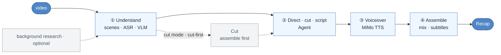

# video-recap-skills

[](LICENSE)


[中文](README.md) · English

**In Claude Code, Codex CLI, OpenCode, or OpenClaw, one natural-language request turns a video into a Chinese-narration recap.** Locally it needs only Python and `ffmpeg`; the AI capabilities can run fully free: TTS via Microsoft `edge-tts`, ASR via local FunASR, and VLM via a free vision endpoint (e.g. GLM-4V-Flash) — or a single [Xiaomi MiMo](https://platform.xiaomimimo.com) API key can power all of them. No GPU, no model downloads, and it runs on macOS / Linux / Windows.

## Skills at a glance

| Skill | Responsibility | Input → Output (`work_dir` contract) |
|---|---|---|
| **video-understanding** | Scene detection · frame extraction · ASR (`mimo-v2.5-asr`) · VLM (`mimo-v2.5`) · timeline fusion · brief generation | `video` → `scenes / asr_result / vlm_analysis / silence_periods / timeline_fusion / agent_narration_brief.md` |
| **video-script** | Directing / story / picture / sound plan + narration writing + advisory review + lint/validation | `brief + index` → `recap_story_plan.json + visual_audio_board.json + [clip_plan.json] + narration.json` |
| **video-cut** | Clip plan → assembled cut (cut mode writes narration on the output timeline; no remapping) | `clip_plan.json + video` → `edited_source.mp4` |
| **video-voiceover** | Synthesize narration audio (MiMo TTS, `mimo-v2.5-tts`) | `narration.json` → `tts_segments/ + tts_meta.json` |
| **video-assemble** | Mixing · ducking · subtitle rendering · multitrack timeline (optional JianYing export) | `video + tts_meta` → `recap_<name>.mp4 + subtitles.srt/.ass + timeline.json` |
| **video-recap** | Orchestrator & environment diagnostics | `video` → `recap_<name>.mp4` |

## Workflow



## Why use it

- **Runs free end to end.** It defaults to [Xiaomi MiMo](https://platform.xiaomimimo.com) (one key drives ASR + VLM + TTS), but every capability has a free alternative: TTS via `TTS_ENGINE=edge-tts`, ASR via `ASR_ENGINE=funasr` (local SenseVoice), and VLM by pointing `MIMO_VIDEO_API_URL` at a free vision endpoint. Locally only the Python standard library and `ffmpeg` are needed, no `pip install`.
- **Creative decisions first, sound second.** The agent compares edit hypotheses, locks in POV, spine, concrete shots, and original-audio anchors; narration is voiced in whole blocks only when it has a job, while strong dialogue, action sound, or silence may fully own a beat.
- **Cut first, then voice, picture-aligned.** Cut mode assembles the long video into the final cut first, then writes narration against that output timeline, so timing aligns naturally.
- **Multi-video cutting, reusable analysis.** Pass several videos and cut segments by `source_id` into one cut; each video's analysis is stored as a file-system material library, reused by `grep` instead of recomputed.
- **Keep editing in JianYing.** Optionally export a schema-driven multitrack JianYing draft, with original clips, narration, BGM, subtitles, and local image overlays all editable. ffmpeg remains the final verdict on the rendered cut.
- **Tested and CI-protected.** Every skill ships isolated unit and contract tests; GitHub Actions runs lint + tests on Ubuntu / macOS / Windows (see "Tests" below).

## Installation

### 1. Common prerequisites

- Python 3.10+
- `ffmpeg` available on `PATH`; burned-in subtitles are on by default, so a libass / `subtitles` filter is required
- AI capabilities: by default a [Xiaomi MiMo](https://platform.xiaomimimo.com) API key (driving ASR, VLM, and TTS), or the free configuration in "Free setup" below

```bash
brew install ffmpeg                         # macOS
sudo apt install ffmpeg                    # Debian / Ubuntu
choco install ffmpeg                       # Windows, or scoop / winget

export MIMO_API_KEY=your-mimo-key          # macOS / Linux (MiMo setup)
export MIMO_TOKEN_PLAN_CLUSTER=cn          # tp-* key optional: cn | sgp | ams
```

On Windows PowerShell use `$env:MIMO_API_KEY="your-mimo-key"`. Pay-as-you-go `sk-*` keys default to `https://api.xiaomimimo.com/v1`; advanced model, voice, loudness, and subtitle settings are in the [config playbook](skills/video-recap/references/config-playbook.md).

### 1.5 Free setup (optional, no MiMo key needed)

Each AI capability can be switched to a free implementation, so a fully free end-to-end run is possible:

| Capability | Env var | Notes |
|---|---|---|
| TTS | `TTS_ENGINE=edge-tts` | Microsoft edge-tts free speech synthesis (rich Chinese voices, no key) |
| ASR | `ASR_ENGINE=funasr` | Local FunASR / SenseVoice transcription; also needs `FUNASR_BIN` (executable) and `FUNASR_MODEL` (e.g. `sensevoice-small-q8.gguf`) |
| VLM | point `MIMO_VIDEO_API_URL` at a free vision endpoint and set `MIMO_MODEL` accordingly | e.g. Zhipu GLM-4V-Flash or another OpenAI-compatible free endpoint (frames are batched, 5 per request by default) |

Example (fully free):

```bash
export TTS_ENGINE=edge-tts
export ASR_ENGINE=funasr
export FUNASR_BIN=/path/to/llama-funasr-sensevoice
export FUNASR_MODEL=/path/to/sensevoice-small-q8.gguf
export MIMO_VIDEO_API_URL=https://your-free-vlm-endpoint/v1
export MIMO_MODEL=glm-4v-flash
```

A partial switch works too — e.g. keep MiMo VLM/ASR and only swap the voiceover for free edge-tts. Capabilities without a free override keep using MiMo (needs `MIMO_API_KEY`).

### 2. Pick an agent host

#### Claude Code

Inside Claude Code:

```text
/plugin marketplace add lybhb8/video-recap-skills-free
/plugin install video-recap-skills@video-recap
```

Or just say:

```text
Install this plugin: https://github.com/lybhb8/video-recap-skills-free
```

#### Codex CLI

```bash
codex plugin marketplace add lybhb8/video-recap-skills-free
codex plugin add video-recap-skills@video-recap
```

For a local checkout, point the source of the first command at the directory path.

#### OpenCode

Per the [OpenCode Agent Skills docs](https://opencode.ai/docs/skills/), project-level skills live under `.opencode/skills/<name>/SKILL.md`. After cloning, start OpenCode from the repo directory:

```bash
git clone https://github.com/lybhb8/video-recap-skills-free.git
cd video-recap-skills-free
mkdir -p .opencode
ln -s ../skills .opencode/skills             # macOS / Linux
opencode debug skill
```

On Windows, copy `skills\*` into `.opencode\skills\`. Use `video-recap` for end-to-end production, `video-script` for planning/writing only, and the other four skills for the tooling stages.

#### OpenClaw

Clone the repo, import the Claude plugin package, and check the skills list:

```bash
openclaw plugins install ./video-recap-skills-free
openclaw skills list
```

Do not register the same skills under multiple discovery directories, or you may get duplicate triggers.

After installing, ask the agent to self-check the environment:

```text
Check the video-recap runtime and tell me whether Python, ffmpeg/libass, and the MiMo config are ready.
```

## Usage

Just give the video path, the desired output, and any necessary background. You never need to run the repo's Python scripts by hand.

**Full-video recap:**

```text
Make a Chinese-narration recap of /path/to/video.mp4. This is episode 1 of <Title>, the protagonist is <Name>, burn the subtitles in.
```

**Long video cut into a short recap:**

```text
Cut /path/to/long.mp4 into a ten-minute recap, keeping the key original audio and character reactions.
```

**Multiple videos into one story:**

```text
Use /path/to/ep1.mp4 and /path/to/ep2.mp4 to make a ten-minute recap, editing around one through-line; do not split it into two mini-summaries.
```

The agent handles understanding, story & AV planning, cutting, script writing, voiceover, and assembly automatically. In cut mode it decides the kept clips first, renders the edited cut, then writes narration on the output timeline; pauses and resume are also handled by the agent.

## Outputs

- `recap_<name>.mp4`: the final cut (fixed output name, overwritten in place on each run); subtitles are burned in by default, with `subtitles.srt` and `subtitles.ass` also written
- `work_dir/narration.json`: the narration script (`narration_lint.json` timing diagnostics, `narration_review.md` review notes)
- `work_dir/recap_story_plan.json` · `visual_audio_board.json`: the agent's story, picture, and sound decisions
- `work_dir/clip_plan.json` · `edited_source.mp4` · `recap_phase.json`: cut-mode artifacts
- `work_dir/timeline.json` · `tts_segments/` · `tts_meta.json`: multitrack timeline and TTS audio
- `work_dir/mimo_qc.json`: optional advisory MiMo suggestions before assembly / after the cut (multi-stage, never blocking)

## Repository layout

```text
video-recap-skills/
├── skills/                     # Six agent skills, each with SKILL.md + scripts/ + references/
│   ├── video-understanding/    # Understanding: scenes · ASR · VLM · timeline fusion · brief
│   ├── video-script/           # Directing & writing: story/AV plan + narration + lint/validation
│   ├── video-cut/              # Cutting: clip_plan → edited_source.mp4
│   ├── video-voiceover/        # Voiceover: narration → tts_segments + tts_meta
│   ├── video-assemble/         # Assembly: mixing/ducking/subtitles/JianYing export
│   └── video-recap/            # Orchestrator: full pipeline + environment diagnostics
├── tests/                      # Per-skill isolated tests (unit + contract + integration)
├── scripts/                    # Test entry points test.py / test.sh
├── tools/                      # Helper tools (e.g. measure_subtitle.py subtitle-band measurement)
├── docs/                       # Docs & screenshots (e.g. JianYing export preview)
├── .github/workflows/          # CI: lint + tests on three platforms
├── .claude-plugin/             # Claude Code / Codex plugin manifests
├── README.md · README.en.md    # Bilingual documentation
└── LICENSE                     # MIT
```

## Tests

```bash
python3 scripts/test.py                 # All skills (each in its own isolated process)
python3 scripts/test.py script          # A single skill
python3 -m pytest tests/script -q       # pytest for one skill directory
```

Do not run bare `pytest` / `pytest tests/` from the repo root: skills share module names, and `conftest.py` guards against directory-level direct runs. CI (`.github/workflows/skill-validate.yml`) runs `ruff check` + `scripts/test.py` on Ubuntu / macOS / Windows.

## Reference docs

- Skill contracts: each `skills/<skill>/SKILL.md` (writing rules live in video-script's SKILL.md)
- [Data schema](skills/video-recap/references/data-schema.md) · [Config playbook](skills/video-recap/references/config-playbook.md) · [Multitrack timeline / JianYing export](skills/video-recap/references/timeline-and-jianying.md)
- [Research guide](skills/video-recap/references/research-guide.md) · [VLM prompt templates](skills/video-understanding/references/prompt-templates.md)
- Change history in [CHANGELOG.md](CHANGELOG.md)

## Acknowledgments

- [linux.do](https://linux.do)
- JianYing draft protocol based on [pyJianYingDraft](https://github.com/GuanYixuan/pyJianYingDraft), [capcut-mate](https://github.com/Hommy-master/capcut-mate), and [duo-video](https://github.com/duoec/duo-video).

## License

MIT, see [LICENSE](LICENSE).
