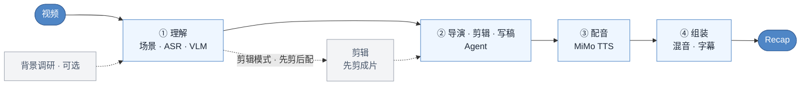

# video-recap-skills

[](LICENSE)


中文 · [English](README.en.md)

**在 Claude Code、Codex CLI、OpenCode 或 OpenClaw 里，用一句自然语言把视频变成中文解说成片。** 本地只需要 Python 和 `ffmpeg`；AI 能力可全免费：TTS 用微软 `edge-tts`、ASR 用本地 FunASR、VLM 可接免费视觉端点（如 GLM-4V-Flash），也可以只用一个[小米 MiMo](https://platform.xiaomimimo.com) API Key 跑通全部能力。不用 GPU，不用下载模型，macOS / Linux / Windows 均可运行。

## 技能一览

| Skill | 职责 | 输入 → 输出（`work_dir` 契约） |
|---|---|---|
| **video-understanding** | 场景检测 · 抽帧 · ASR（`mimo-v2.5-asr`）· VLM（`mimo-v2.5`）· 时间轴融合 · 生成 brief | `视频` → `scenes / asr_result / vlm_analysis / silence_periods / timeline_fusion / agent_narration_brief.md` |
| **video-script** | 导演/故事/画面/声音方案 + 解说写作 + 建议型评审 + lint/校验 | `brief + 索引` → `recap_story_plan.json + visual_audio_board.json + [clip_plan.json] + narration.json` |
| **video-cut** | 片段计划 → 拼剪成片（剪辑模式先剪后配，解说按成片时间轴写，无需重映射） | `clip_plan.json + 视频` → `edited_source.mp4` |
| **video-voiceover** | 合成解说音频（MiMo TTS，`mimo-v2.5-tts`） | `narration.json` → `tts_segments/ + tts_meta.json` |
| **video-assemble** | 混音 · 压低原声 · 渲染字幕 · 多轨时间线（可选导出剪映） | `视频 + tts_meta` → `recap_<名>.mp4 + subtitles.srt/.ass + timeline.json` |
| **video-recap** | 编排器与环境诊断 | `视频` → `recap_<名>.mp4` |

## 工作流



## 为什么用它

- **免费也能跑全程。** 默认走[小米 MiMo](https://platform.xiaomimimo.com)（一个 key 驱动 ASR + VLM + TTS），但每项能力都有免费替代：TTS 切 `TTS_ENGINE=edge-tts`、ASR 切 `ASR_ENGINE=funasr`（本地 SenseVoice）、VLM 把 `MIMO_VIDEO_API_URL` 指向免费视觉端点即可；本地运行时只有 Python 标准库和 `ffmpeg`，不用 `pip install`。
- **先做创作决定，再分配声音。** Agent 先比较剪辑假设，锁定 POV、主线、具体画面与原声锚点；旁白有明确任务时才整块配音，强对白、动作声或沉默可以完整主导一个 beat。
- **先剪后配，画面对齐。** 剪辑模式先把长视频剪成成片，再对着成片写解说，时间轴天然对齐。
- **多视频也能剪，分析可复用。** 一次传多个视频，按 `source_id` 选段剪成一个成片；每个视频的分析沉淀为文件系统素材库，下次 `grep` 复用、不重算。
- **能接着在剪映里改。** 可选导出 schema-driven 的多轨剪映草稿，原片、解说、BGM、字幕和本地图片叠层都可编辑。ffmpeg 仍是最终成片的判定标准。
- **测试与 CI 护航。** 六个技能都有隔离的单元测试与契约测试，GitHub Actions 在 Ubuntu / macOS / Windows 三平台跑 lint + 测试（见下方「测试」）。

## 安装

### 1. 通用前置

- Python 3.10+
- `PATH` 上可用的 `ffmpeg`；默认烧录字幕，因此需要带 libass / `subtitles` 滤镜
- AI 能力：默认需要[小米 MiMo](https://platform.xiaomimimo.com) API Key（同时驱动 ASR、VLM 和 TTS），或按下方「免费方案」配置免费的 TTS / ASR / VLM

```bash
brew install ffmpeg                         # macOS
sudo apt install ffmpeg                    # Debian / Ubuntu
choco install ffmpeg                       # Windows，也可用 scoop / winget

export MIMO_API_KEY=your-mimo-key          # macOS / Linux（MiMo 方案）
export MIMO_TOKEN_PLAN_CLUSTER=cn          # tp-* key 可选：cn | sgp | ams
```

Windows PowerShell 使用 `$env:MIMO_API_KEY="your-mimo-key"`。按量付费的 `sk-*` key 默认连接 `https://api.xiaomimimo.com/v1`；模型、音色、响度和字幕等高级配置见[配置手册](skills/video-recap/references/config-playbook.md)。

### 1.5 免费方案（可选，无需 MiMo key）

三项 AI 能力各自可切到免费实现，全免费即可端到端出片：

| 能力 | 环境变量 | 说明 |
|---|---|---|
| TTS | `TTS_ENGINE=edge-tts` | 微软 edge-tts 免费语音合成（中文音色丰富，无需 key） |
| ASR | `ASR_ENGINE=funasr` | 本地 FunASR / SenseVoice 转写，另需 `FUNASR_BIN`（可执行文件）与 `FUNASR_MODEL`（如 `sensevoice-small-q8.gguf`） |
| VLM | `MIMO_VIDEO_API_URL` 指向免费视觉端点，`MIMO_MODEL` 设为对应模型 | 如智谱 GLM-4V-Flash 等 OpenAI 兼容免费端点（帧图分批发送，默认每批 5 张） |

示例（全免费）：

```bash
export TTS_ENGINE=edge-tts
export ASR_ENGINE=funasr
export FUNASR_BIN=/path/to/llama-funasr-sensevoice
export FUNASR_MODEL=/path/to/sensevoice-small-q8.gguf
export MIMO_VIDEO_API_URL=https://your-free-vlm-endpoint/v1
export MIMO_MODEL=glm-4v-flash
```

只切换其中一部分也可以——例如保留 MiMo VLM/ASR、仅把配音换成免费的 edge-tts。未配置免费项时仍走 MiMo（需 `MIMO_API_KEY`）。

### 2. 选择 Agent 宿主

#### Claude Code

在 Claude Code 内执行：

```text
/plugin marketplace add lybhb8/video-recap-skills-free
/plugin install video-recap-skills@video-recap
```

也可以直接说：

```text
安装这个插件：https://github.com/lybhb8/video-recap-skills-free
```

#### Codex CLI

```bash
codex plugin marketplace add lybhb8/video-recap-skills-free
codex plugin add video-recap-skills@video-recap
```

本地仓库可把第一条命令的源换成目录路径。

#### OpenCode

[OpenCode 官方 Agent Skills 文档](https://opencode.ai/docs/skills/)规定项目级技能放在 `.opencode/skills/<name>/SKILL.md`。克隆仓库后，从仓库目录启动 OpenCode：

```bash
git clone https://github.com/lybhb8/video-recap-skills-free.git
cd video-recap-skills-free
mkdir -p .opencode
ln -s ../skills .opencode/skills             # macOS / Linux
opencode debug skill
```

Windows 可把 `skills\*` 复制到 `.opencode\skills\`。日常端到端制作使用 `video-recap`；只做策划或写稿时可调用 `video-script`；其余四个技能负责工具阶段。

#### OpenClaw

克隆仓库后导入 Claude 插件包，并检查技能列表：

```bash
openclaw plugins install ./video-recap-skills-free
openclaw skills list
```

不要把同一份技能同时注册到多个发现目录，否则可能出现重名或重复触发。

安装完成后，可以让 Agent 自检环境：

```text
检查 video-recap 的运行环境，告诉我 Python、ffmpeg/libass 和 MiMo 配置是否就绪。
```

## 怎么用

直接给出视频路径、期望成片和必要背景。用户不需要手动运行仓库里的 Python 脚本。

**完整视频解说：**

```text
给 /path/to/video.mp4 做一个中文解说成片。这是《庆余年》第一集，主角是范闲，字幕烧进画面。
```

**长视频剪成短解说：**

```text
把 /path/to/long.mp4 剪成十分钟左右的解说短片，保留关键原声和人物反应。
```

**多视频合成一个故事：**

```text
用 /path/to/ep1.mp4 和 /path/to/ep2.mp4 做一个十分钟解说，围绕同一条主线剪辑，不要分成两个小总结。
```

Agent 会自动完成理解、故事与视听规划、剪辑、写稿、配音和合成。剪辑模式内部会先确定保留片段，生成剪后成片后再按输出时间轴写旁白；这些暂停和续跑也由 Agent 处理。

## 输出

- `recap_<名>.mp4`：成片（固定输出名，每次运行原地覆盖）；字幕默认烧录，同时产出 `subtitles.srt` 与 `subtitles.ass`
- `work_dir/narration.json`：解说脚本（`narration_lint.json` 时间诊断、`narration_review.md` 评审意见）
- `work_dir/recap_story_plan.json` · `visual_audio_board.json`：Agent 的故事、画面与声音决定
- `work_dir/clip_plan.json` · `edited_source.mp4` · `recap_phase.json`：剪辑模式产物
- `work_dir/timeline.json` · `tts_segments/` · `tts_meta.json`：多轨时间线与 TTS 音频
- `work_dir/mimo_qc.json`：可选的组装前/成片后 MiMo 建议（多阶段聚合、永不阻断）

## 仓库结构

```text
video-recap-skills/
├── skills/                     # 六个 Agent 技能，每个自带 SKILL.md + scripts/ + references/
│   ├── video-understanding/    # 理解：场景 · ASR · VLM · 时间轴融合 · brief
│   ├── video-script/           # 导演与写稿：故事/视听方案 + 解说 + lint/校验
│   ├── video-cut/              # 剪辑：clip_plan → edited_source.mp4
│   ├── video-voiceover/        # 配音：narration → tts_segments + tts_meta
│   ├── video-assemble/         # 合成：混音/压原声/字幕/剪映导出
│   └── video-recap/            # 编排器：串起全流程 + 环境诊断
├── tests/                      # 按技能分组的隔离测试（单元 + 契约 + 集成）
├── scripts/                    # 测试入口 test.py / test.sh
├── tools/                      # 辅助工具（如 measure_subtitle.py 字幕带测量）
├── docs/                       # 文档与截图（如剪映导出预览）
├── .github/workflows/          # CI：三平台 lint + 测试
├── .claude-plugin/             # Claude Code / Codex 插件清单
├── README.md · README.en.md    # 中英文说明
└── LICENSE                     # MIT
```

## 测试

```bash
python3 scripts/test.py                 # 全部技能测试（每个技能隔离进程运行）
python3 scripts/test.py script          # 只跑某个技能
python3 -m pytest tests/script -q       # pytest 直接跑单个技能
```

不要直接在仓库根目录跑 `pytest` / `pytest tests/`：技能之间会串模块，`conftest.py` 已对目录级直跑做了保护。CI（`.github/workflows/skill-validate.yml`）在 Ubuntu / macOS / Windows 三平台执行 `ruff check` + `scripts/test.py`。

## 参考文档

- 各 skill 的契约：每个 `skills/<skill>/SKILL.md`（写作规则在 video-script 的 SKILL.md 里）
- [数据结构](skills/video-recap/references/data-schema.md) · [配置手册](skills/video-recap/references/config-playbook.md) · [多轨时间线 / 剪映导出](skills/video-recap/references/timeline-and-jianying.md)
- [背景调研指南](skills/video-recap/references/research-guide.md) · [VLM prompt 模板](skills/video-understanding/references/prompt-templates.md)
- 变更记录见 [CHANGELOG.md](CHANGELOG.md)

## 致谢

- [linux.do](https://linux.do)
- 剪映草稿协议参考 [pyJianYingDraft](https://github.com/GuanYixuan/pyJianYingDraft)、[capcut-mate](https://github.com/Hommy-master/capcut-mate) 和 [duo-video](https://github.com/duoec/duo-video)。

## 许可

MIT，见 [LICENSE](LICENSE)。
